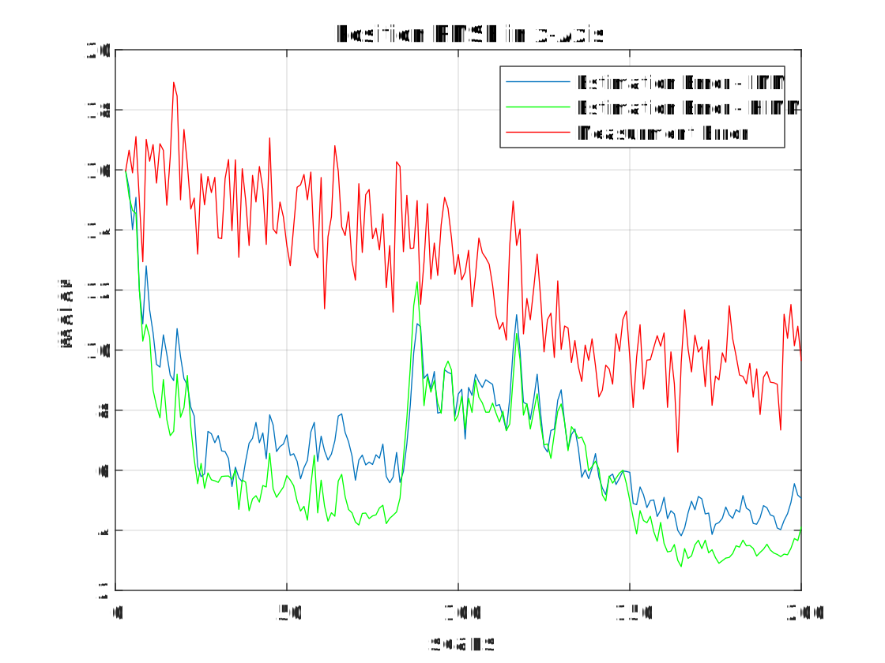
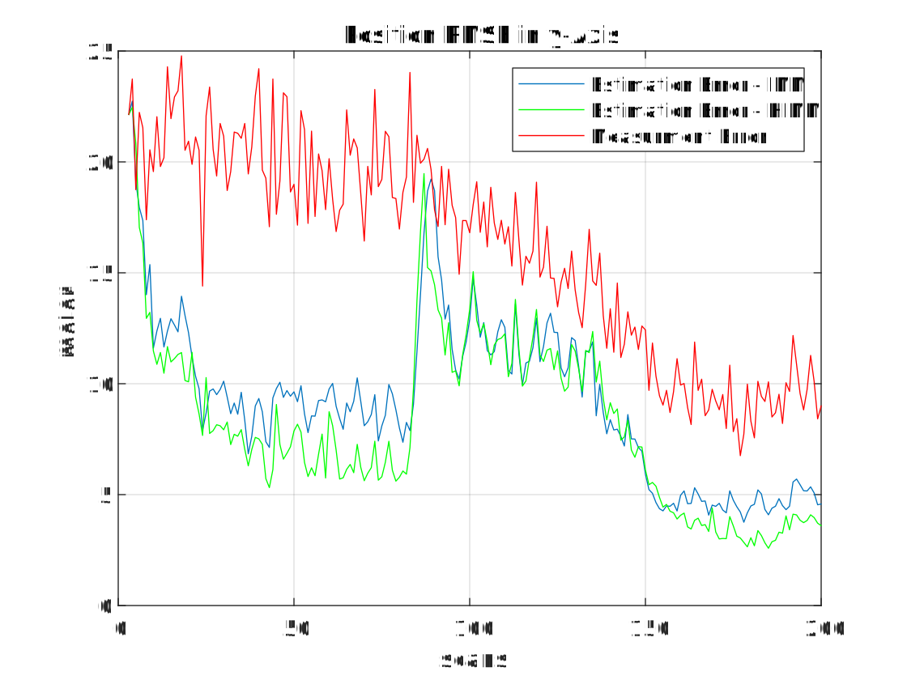
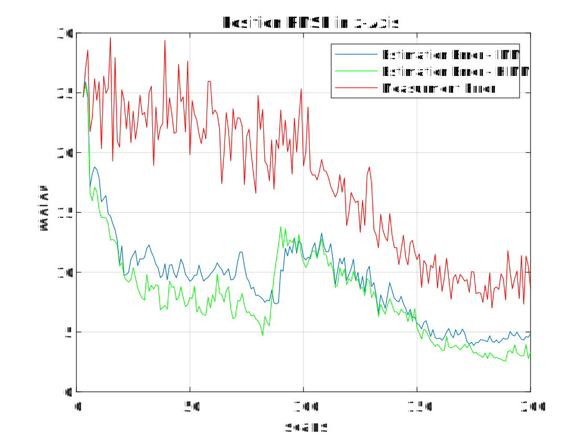

# Multiple model estimation under perspective of random-fuzzy dual interpretation of unknown uncertainty

## Introduction

[Paper Link](https://www.sciencedirect.com/science/article/abs/pii/S0165168423004127)
1. Mei, W., Xu, Y. & Liu, L. Multiple model estimation under perspective of random-fuzzy dual interpretation of unknown uncertainty. Signal Process. 217, 109338 (2024).

This code was implemented using Matlab, the python version is [here](https://github.com/SongJgit/filternet).


## Usage
In Matlab R2022a(9.12.0.1884302)64-bit (win64) February 16,2022 or otherwise, run 

```matlab
Main_FuzzyRandom_IMMfilter_CACV.m
```

## Partial results 

### RMSE





## Citation

If you find our paper/code helpful, please cite it!

```
@article{MEI2024109338,
title = {Multiple model estimation under perspective of random-fuzzy dual interpretation of unknown uncertainty},
journal = {Signal Processing},
volume = {217},
pages = {109338},
year = {2024},
issn = {0165-1684},
doi = {https://doi.org/10.1016/j.sigpro.2023.109338},
url = {https://www.sciencedirect.com/science/article/pii/S0165168423004127},
author = {Wei Mei and Yunfeng Xu and Limin Liu},
keywords = {Fuzzy system, IMM filter, Markovian jump system, Possibility theory, Sigma-max inference, Time series prediction},
abstract = {This study considered the problem of multiple model estimation from the perspective of sigma-max inference (probability - possibility inference), while focusing on discovering whether certain of the unknown quantities involved could be more faithfully modeled as fuzzy uncertainty. Two related key issues were addressed: 1) The random-fuzzy dual interpretation of unknown quantity being inferred. 2) The principle of selecting sigma-max operator for estimation and recognition. This study considered that any continuous unknown quantity involved in estimation should be more appropriately modeled as randomness and handled by sigma inference; whereas, a discrete unknown quantity involved in recognition could be better modeled as fuzziness and handled by max inference. Consequently, the interacting multiple model (IMM) filter was reformulated in the framework of sigma-max inference, where the Markovian jump system was reformulated as a hybrid uncertainty system, with continuous state evolution modeled as usual as model-conditioned stochastic systems and discrete mode transition modeled as a fuzzy system using a possibility transition matrix, and hypotheses mixing was conducted by using the operation of “max” instead of “sigma.” For our examples of time series prediction and maneuvering target tracking, the updated IMM filter exhibited remarkable improvement over the classic IMM filter.}
}
```